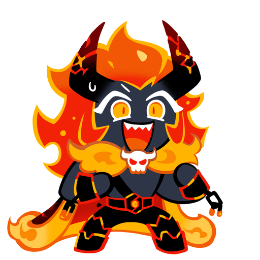
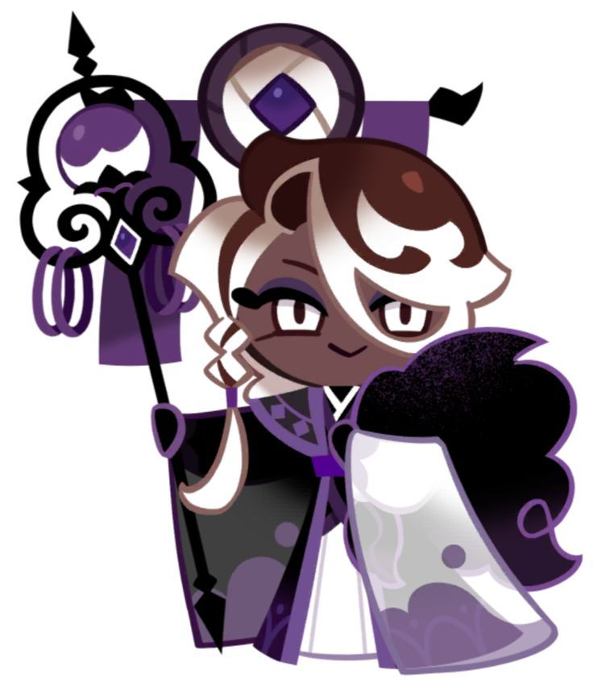

* 팀 명 : 기정사실화 
* 프로젝트명 : DevMoa 
* 프로젝트 소개 : 개발자 커뮤니티 Hello Developer 
* 프로젝트 기간 : 2023.05.01 - 2023.05.31 
* 배포링크: http://mainmay.s3-website.ap-northeast-2.amazonaws.com/ 

 

## Team
### 🌅 Front-end

|Frontend (팀장)|Frontend|Frontend|
| :---: | :---: | :---: |
|  |  |  |
|[박기정](https://github.com/rlwjd31)|[노유하](https://github.com/yuhallo)|[홍윤수](https://github.com/Yunsu0928)|

 

### 🌅 Back-end

|Backend (팀장)|Backend|Backend|
| :---: | :---: | :---: |
|  |  |  |
|[김상래](https://github.com/ksr0818)|[김경아](https://github.com/kkyunga)|[김은정](https://github.com/196code-gray)|

 

## Demo
###

 

## ⚙ Tech Stack
### 🌅 Front-end
          

### 🌄 Back-end
                  

### 🔐 Server
  
